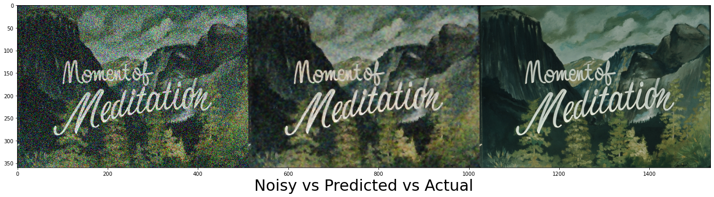

Image Noise Remover
============

This is a Autoencoder model prepared to remove noise from images of size 512x360



## Setup

Download a lot of images from the internet, e.g. kaggle
Put some of those images in dataset/test & the rest in dataset/train


## Repository Structure
```
┣ 📂datasets
┃  ┗ train
┃  ┗ test
┣ De-noise.ipynb
┣ De-noise-Pre-trained.h5
┣ README.md
```
